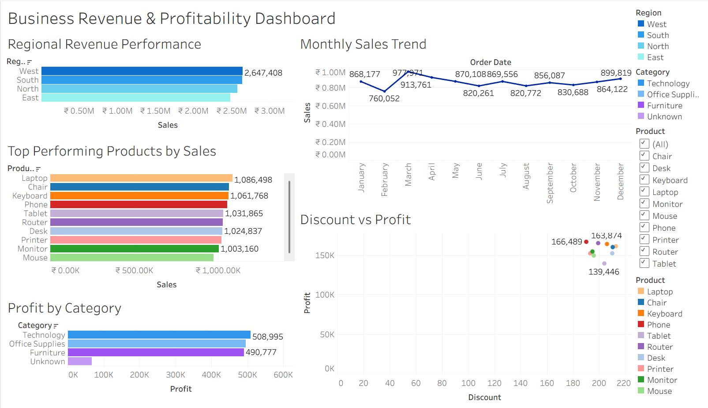

# Business Revenue & Profitability Analysis

## Overview
This project analyzes business sales data to identify key revenue drivers, product performance, and profitability trends. The analysis includes data cleaning, exploratory analysis, and an interactive Tableau dashboard.

## Tools Used
- Python (Pandas, NumPy)
- Data Cleaning
- Tableau Public
- Data Visualization

## Key Insights
- West region generates the highest revenue.
- Technology category produces the highest profit.
- Laptop and Chair are the top performing products.
- Higher discounts tend to reduce profitability.

## Dashboard Preview

## Files
- raw_sales_dataset.csv → Raw generated dataset
- cleaned_sales_data.csv → Cleaned dataset used for analysis
- data_analysis.ipynb → Python data analysis notebook
- business_revenue_dashboard.twbx → Tableau dashboard
